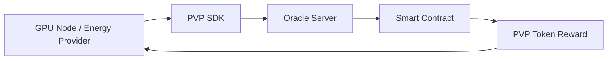

```
 ____  __     __ ____    ____                      _     
|  _ \ \ \   / /|  _ \  / ___| ___ _ __   ___  ___(_)___ 
| |_) | \ \ / / | |_) || |  _ / _ \ '_ \ / _ \/ __| / __|
|  __/   \ V /  |  __/ | |_| |  __/ | | |  __/\__ \ \__ \
|_|       \_/   |_|     \____|\___|_| |_|\___||___/_|___/
                                                          
```


[](https://github.com/ahmet/awesome-web3)

# PVP Genesis SDK

**The first protocol to monetize physical energy for the AI economy.**

PVP Genesis enables the conversion of real-world energy (joules, kWh) and compute resources (FLOPs) into blockchain tokens on Polygon. Built with oracle-verified signatures, difficulty adjustment, and enterprise-grade security, PVP Genesis is the standard for DePIN (Decentralized Physical Infrastructure Networks) in the AI era.

---

## 🏗️ Architecture



**Flow:**
1. **Miner** performs Proof-of-Work (PoW) computation
2. **Oracle** verifies and signs the work
3. **Smart Contract** validates signature and mints PVP tokens
4. **Rewards** distributed to miner's wallet

---

## 🚀 Quick Start

### Installation

```bash
npm install pvp-genesis-sdk
```

### Basic Usage

```javascript
import { PVPClient } from 'pvp-genesis-sdk';

const client = new PVPClient('YOUR_PRIVATE_KEY');

// Mine and submit work
const receipt = await client.mineAndSubmit('http://oracle-url');
console.log('Work submitted!', receipt.hash);
```

---

## 📚 Examples

### 1. Miner Bot (Automated Mining)

```bash
node examples/miner-bot.js
```

**Features:**
- Continuous mining loop
- Automatic difficulty adjustment
- Balance tracking
- Error recovery

### 2. Oracle Server (Work Verification)

```bash
node examples/oracle-server.js
```

**Features:**
- HTTP API for signature requests
- Work validation
- CORS support
- Health check endpoint

---

## 🔧 API Reference

### `PVPClient`

#### Constructor
```javascript
new PVPClient(privateKey, rpcUrl?)
```

#### Methods

**`getDifficulty()`**
- Returns current mining difficulty

**`getReward()`**
- Returns current work reward in PVP tokens

**`getBalance(address?)`**
- Returns PVP token balance

**`mine()`**
- Finds valid nonce for current difficulty
- Returns `{ difficulty, nonce, hash }`

**`submitWork(difficulty, nonce, signature)`**
- Submits work to smart contract
- Returns transaction receipt

**`mineAndSubmit(oracleUrl)`**
- Full cycle: mine → get signature → submit
- Returns transaction receipt

---

### `PVPOracle`

#### Constructor
```javascript
new PVPOracle(privateKey)
```

#### Methods

**`signWork(miner, difficulty, nonce)`**
- Signs valid work submission
- Returns signature string

**`verifyWork(miner, difficulty, nonce)`**
- Verifies work meets difficulty target
- Returns boolean

---

## 🌐 Contract Details

| Network | Polygon Mainnet |
|---------|-----------------|
| **Contract Address** | `0x742d35Cc6634C0532925a3b844Bc9e7595f0bEb` |
| **Token Symbol** | PVP |
| **Decimals** | 18 |
| **Explorer** | [PolygonScan](https://polygonscan.com/address/0x742d35Cc6634C0532925a3b844Bc9e7595f0bEb) |

---

## 🔐 Security

### Oracle Signature Verification
- All work submissions require oracle signature
- Prevents unauthorized token minting
- Replay attack protection

### Difficulty Adjustment
- Dynamic difficulty based on network hashrate
- Maintains consistent block time
- Prevents mining centralization

### Smart Contract Audits
- ✅ Automated security scans
- ✅ Manual code review
- ✅ Testnet validation

---

## 💡 Use Cases

### 1. GPU Mining Pools
Convert GPU compute into PVP tokens

### 2. Energy Providers
Monetize excess renewable energy

### 3. AI Training Farms
Earn rewards for model training compute

### 4. Edge Computing Networks
Decentralized compute marketplace

---

## 🛠️ Development

### Clone Repository
```bash
git clone https://github.com/Synapse-Founder/pvp-genesis-sdk.git
cd pvp-genesis-sdk
npm install
```

### Run Tests
```bash
npm test
```

### Build
```bash
npm run build
```

---

## 📖 Documentation

- **Website:** https://pvp-genesis.io
- **Whitepaper:** https://pvp-genesis.io/whitepaper.pdf
- **API Docs:** https://docs.pvp-genesis.io

---

## 🤝 Contributing

We welcome contributions! Please see [CONTRIBUTING.md](CONTRIBUTING.md) for guidelines.

---

## 📄 License

MIT License - see [LICENSE](LICENSE) file for details.

---

## 🔗 Links

- **GitHub:** https://github.com/Synapse-Founder/pvp-genesis-sdk
- **NPM:** https://www.npmjs.com/package/pvp-genesis-sdk
- **Discord:** https://discord.gg/pvp-genesis
- **Twitter:** https://twitter.com/pvp_genesis

---

**Built for the AI economy** ⚡
